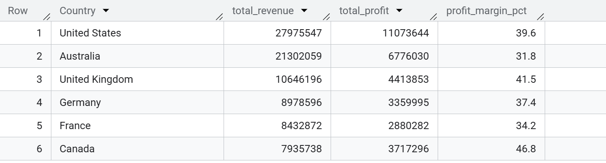
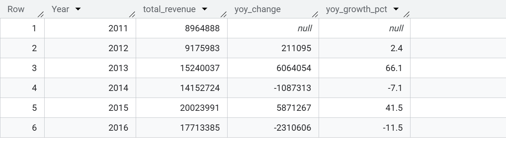
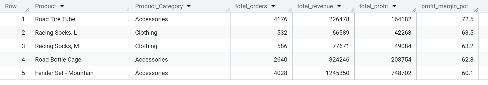
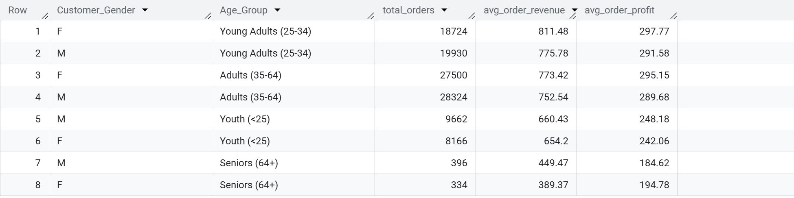
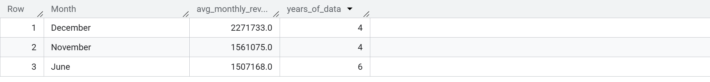
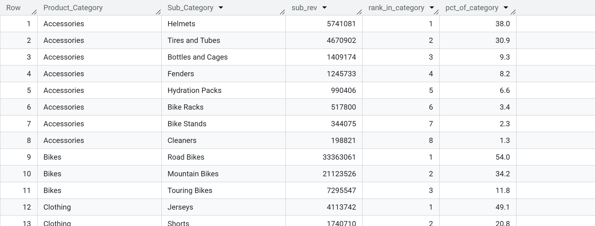
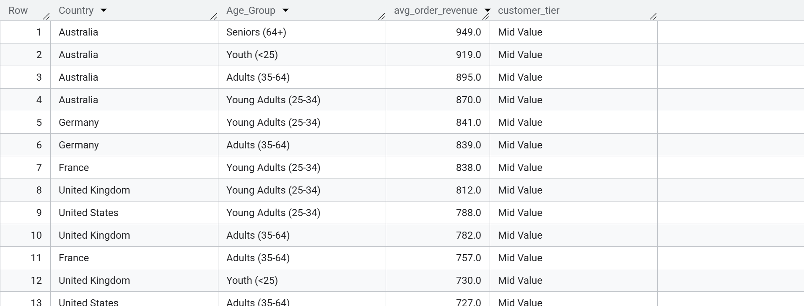
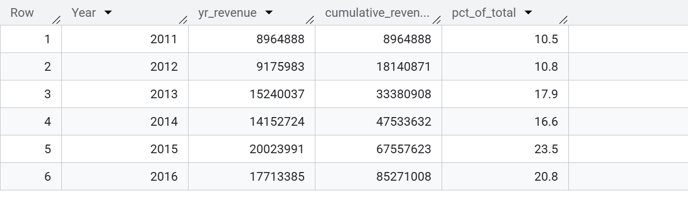
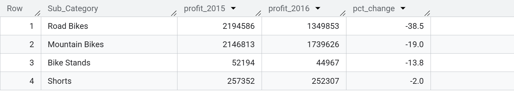
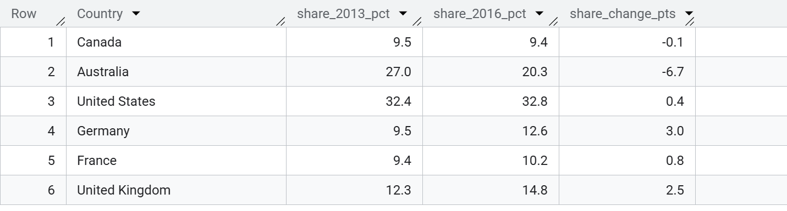

<h1 align="center">Retail Sales SQL Analytics</h1>

<p align="center">
  
  
  
  
  
</p>


<p align="center">
This project presents a structured SQL analysis of a global retail dataset containing over 113,000 transactions across multiple countries and product categories.  
The analysis focuses on revenue performance, profitability, customer behavior, and market share trends using advanced SQL techniques in Google BigQuery.
</p>

---

# Project Overview

This project demonstrates practical SQL skills applied to a real-world retail dataset.  
The goal is to answer key business questions about revenue generation, profitability, customer segmentation, and product performance.

The analysis progresses from **basic aggregations to advanced analytical SQL techniques**, including:

- Aggregations and filtering
- Common Table Expressions (CTEs)
- Window functions
- Ranking and cumulative calculations
- Multi-step analytical queries

The queries were executed using **Google BigQuery**, a cloud-based data warehouse optimized for large-scale data analytics.

---

# Dataset Overview

The dataset contains **113,035 retail transactions recorded between 2011 and 2016** across multiple international markets.

### Key Dimensions

| Field | Description |
|------|-------------|
| Country | Customer country |
| Product | Product purchased |
| Product_Category | High level product category |
| Sub_Category | Specific product grouping |
| Customer_Gender | Customer gender |
| Age_Group | Customer demographic group |
| Year | Year of transaction |
| Month | Month of transaction |

### Key Metrics

| Metric | Description |
|------|-------------|
| Revenue | Sales revenue generated from each transaction |
| Profit | Profit earned per transaction |
| Order Quantity | Number of units sold |

---

# Analytical Objectives

The analysis aims to answer several important business questions:

• Which countries generate the most revenue and profit?  
• How has revenue changed year-over-year?  
• Which products have the highest profit margins?  
• Which customer segments generate the highest value?  
• What seasonal trends influence sales performance?  
• How do product subcategories contribute to category revenue?  
• Which markets gained or lost market share over time?

---

# SQL Analysis

The following queries progressively analyze the dataset from basic metrics to deeper market insights.


### Q01 — Revenue & Profit by Country

*Which country generated the highest total revenue and total profit? Return both metrics with profit margin percentage, ordered by revenue descending.*

```sql
SELECT
  Country,
  SUM(Revenue) AS total_revenue,
  SUM(Profit) AS total_profit,
  ROUND(SUM(Profit) / SUM(Revenue) * 100, 1) AS profit_margin_pct
FROM `sales.sales_data`
GROUP BY Country
ORDER BY total_revenue DESC;

```

**Query Output**



**Insight**

Revenue distribution across countries reveals which markets drive the majority of sales performance.  
While the highest-revenue country generates the largest share of sales, it may not necessarily produce the highest profit margin.

This suggests that operational costs, product pricing strategies, and local market dynamics vary across regions.  
Countries with strong revenue but lower margins may indicate opportunities to optimize pricing or reduce costs.

---

### Q02 — Year-over-Year Revenue Growth

*Calculate total revenue per year and show the absolute and percentage change from the previous year. Which year had the biggest growth jump?*

```sql
WITH
  yearly AS (
    SELECT Year, SUM(Revenue) AS total_revenue
    FROM `sales.sales_data`
    GROUP BY Year
  )
SELECT
  Year,
  total_revenue,
  total_revenue - LAG(total_revenue) OVER (ORDER BY Year) AS yoy_change,
  ROUND(
    (total_revenue - LAG(total_revenue) OVER (ORDER BY Year))
      / LAG(total_revenue) OVER (ORDER BY Year)
      * 100,
    1) AS yoy_growth_pct
FROM yearly
ORDER BY Year;

```

**Query Output**


**Insight**

Year-over-year revenue growth highlights the overall expansion trend of the business.  
Periods with strong positive growth indicate successful market expansion or increased demand.

Conversely, slower growth or declines may reflect economic conditions, changes in consumer demand, or increased competition.  
Monitoring these trends allows businesses to identify critical periods that influenced performance.

---

### Q03 — Top 5 Products by Profit Margin

*Find the top 5 products with the highest profit margin. Only include products with more than 500 total orders to remove low-volume noise.*

```sql
SELECT
  Product,
  Product_Category,
  COUNT(*) AS total_orders,
  SUM(Revenue) AS total_revenue,
  SUM(Profit) AS total_profit,
  ROUND(SUM(Profit) / SUM(Revenue) * 100, 1) AS profit_margin_pct
FROM `sales.sales_data`
GROUP BY Product, Product_Category
HAVING COUNT(*) > 500
ORDER BY profit_margin_pct DESC
LIMIT 5;

```

**Query Output**


**Insight**

High profit margin products represent the most efficient contributors to profitability.  
By filtering products with more than 500 orders, the analysis focuses on items with meaningful sales volume rather than statistical outliers.

Products that combine both high margin and high order volume are strategic assets, as they generate strong returns while maintaining consistent demand.

---

### Q04 — Gender & Age Group Spending Behaviour

*For each combination of customer gender and age group, what is the average order revenue, average profit, and total number of orders?*

```sql
SELECT
  Customer_Gender,
  Age_Group,
  COUNT(*) AS total_orders,
  ROUND(AVG(Revenue), 2) AS avg_order_revenue,
  ROUND(AVG(Profit), 2) AS avg_order_profit
FROM `sales.sales_data`
GROUP BY Customer_Gender, Age_Group
ORDER BY avg_order_revenue DESC;

```

**Query Output**


**Insight**

Customer spending patterns vary across gender and age groups.  
Some demographic segments generate significantly higher average order values, indicating stronger purchasing power or product affinity.

Understanding these behavioral patterns enables businesses to tailor marketing campaigns, pricing strategies, and product recommendations to their most valuable customer segments.


### Q05 — Top 3 Months by Average Revenue

*Which three months consistently generate the highest average monthly revenue across all years? Show average revenue per month, ordered highest to lowest.*

```sql
WITH
  monthly AS (
    SELECT Month, Year, SUM(Revenue) AS monthly_rev
    FROM `sales.sales_data`
    GROUP BY Month, Year
  )
SELECT
  Month,
  ROUND(AVG(monthly_rev), 0) AS avg_monthly_revenue,
  COUNT(Year) AS years_of_data
FROM monthly
GROUP BY Month
ORDER BY avg_monthly_revenue DESC
LIMIT 3;
```

**Query Output**


**Insight**

Certain months consistently outperform others in terms of revenue generation.  
This indicates the presence of seasonal demand patterns that influence purchasing behavior.

Identifying these peak months allows businesses to strategically schedule promotions, increase inventory availability, and allocate marketing resources to maximize sales during high-demand periods.

---

### Q06 — Sub-Category Revenue Rank Within Category

*Within each product category, rank sub-categories by total revenue and show what percentage of that category's total revenue each sub-category represents.*

```sql
WITH
  subcat AS (
    SELECT Product_Category, Sub_Category, SUM(Revenue) AS sub_rev
    FROM `sales.sales_data`
    GROUP BY Product_Category, Sub_Category
  )
SELECT
  Product_Category,
  Sub_Category,
  sub_rev,
  RANK()
    OVER (
      PARTITION BY Product_Category ORDER BY sub_rev DESC
    ) AS rank_in_category,
  ROUND(sub_rev * 100.0 / SUM(sub_rev) OVER (PARTITION BY Product_Category), 1)
    AS pct_of_category
FROM subcat
ORDER BY Product_Category, rank_in_category;

```

**Query Output**


**Insight**

Revenue contribution varies significantly across product sub-categories within each main category.  
Some sub-categories dominate category revenue, indicating strong customer demand or market leadership.

This ranking helps businesses identify their most valuable product lines and prioritize inventory management, supplier relationships, and marketing investments accordingly.

---

### Q07 — Customer Value Tiering by Segment

*Classify each country + age group combination as 'High Value' (avg revenue ≥ 1000), 'Mid Value' (500–999), or 'Low Value' (below 500) based on average order revenue.*

```sql
WITH
  seg AS (
    SELECT Country, Age_Group, AVG(Revenue) AS avg_rev
    FROM `sales.sales_data`
    GROUP BY Country, Age_Group
  )
SELECT
  Country,
  Age_Group,
  ROUND(avg_rev, 0) AS avg_order_revenue,
  CASE
    WHEN avg_rev >= 1000 THEN 'High Value'
    WHEN avg_rev >= 500 THEN 'Mid Value'
    ELSE 'Low Value'
    END AS customer_tier
FROM seg
ORDER BY avg_rev DESC;

```

**Query Output**


**Insight**

Customer segments can be categorized into value tiers based on their average order revenue.  
High-value segments represent the most profitable customer groups and are critical for long-term revenue growth.

By identifying these segments, businesses can implement targeted retention strategies, loyalty programs, and premium product offerings to maximize customer lifetime value.

---

### Q08 — Cumulative Revenue by Year

*Show the cumulative revenue by year — for each year, what was the total revenue earned up to and including that year? Also show each year's share of overall total.*

```sql
WITH
  yearly AS (
    SELECT Year, SUM(Revenue) AS yr_revenue
    FROM `sales.sales_data`
    GROUP BY Year
  )
SELECT
  Year,
  yr_revenue,
  SUM(yr_revenue) OVER (ORDER BY Year) AS cumulative_revenue,
  ROUND(yr_revenue * 100.0 / SUM(yr_revenue) OVER (), 1) AS pct_of_total
FROM yearly
ORDER BY Year;

```

**Query Output**


**Insight**

Cumulative revenue illustrates how total sales have grown over time.  
This metric provides a clear picture of the long-term financial trajectory of the business.

Consistent growth in cumulative revenue indicates sustainable expansion, while periods of slower accumulation may reveal economic pressures or shifts in consumer demand.

---

### Q09 — Sub-Categories With Profit Decline (2015 vs 2016)

*Find all sub-categories where total profit in 2016 was lower than in 2015. Return the sub-category, both profit figures, and the percentage decline. Order by largest decline first.*

```sql
WITH
  pivoted AS (
    SELECT
      Sub_Category,
      SUM(CASE WHEN Year = 2015 THEN Profit ELSE 0 END) AS profit_2015,
      SUM(CASE WHEN Year = 2016 THEN Profit ELSE 0 END) AS profit_2016
    FROM sales
    GROUP BY Sub_Category
  )
SELECT
  Sub_Category,
  profit_2015,
  profit_2016,
  ROUND((profit_2016 - profit_2015) * 100.0 / profit_2015, 1) AS pct_change
FROM pivoted
WHERE profit_2016 < profit_2015
ORDER BY pct_change ASC;
```

**Query Output**


**Insight**

Sub-categories experiencing profit declines between 2015 and 2016 may indicate emerging operational challenges or declining product demand.

These trends may result from increased production costs, changing customer preferences, or new market competitors.  
Identifying these declining segments allows businesses to investigate potential corrective actions such as pricing adjustments, product redesign, or marketing repositioning.

---

### Q10 — Country Market Share Shift (2013 vs 2016)

*Compare each country's share of total revenue in 2013 versus 2016. Which country gained the most market share and which lost the most?*

```sql
WITH
  cy AS (
    SELECT
      Country,
      SUM(CASE WHEN Year = 2013 THEN Revenue ELSE 0 END) AS rev_2013,
      SUM(CASE WHEN Year = 2016 THEN Revenue ELSE 0 END) AS rev_2016
    FROM `sales.sales_data`
    GROUP BY Country
  ),
  totals AS (
    SELECT SUM(rev_2013) AS t2013, SUM(rev_2016) AS t2016 FROM cy
  )
SELECT
  cy.Country,
  ROUND(cy.rev_2013 * 100.0 / t.t2013, 1) AS share_2013_pct,
  ROUND(cy.rev_2016 * 100.0 / t.t2016, 1) AS share_2016_pct,
  ROUND((cy.rev_2016 * 100.0 / t.t2016) - (cy.rev_2013 * 100.0 / t.t2013), 1)
    AS share_change_pts
FROM cy
CROSS JOIN totals t
ORDER BY share_change_pts DESC;

```

**Query Output**


**Insight**

Market share analysis reveals how the competitive position of each country evolved between 2013 and 2016.

Countries gaining market share demonstrate stronger sales growth relative to other markets, while declining share may indicate weakening demand or increased competition.

Understanding these shifts helps businesses identify emerging markets and reassess strategies in underperforming regions.

---
